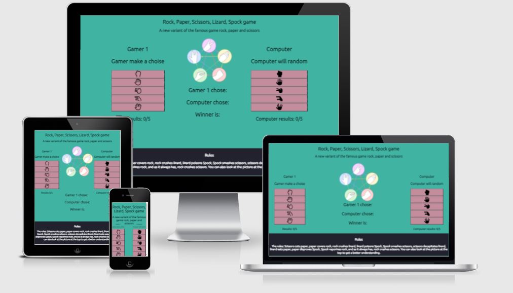

# Rock, Paper, Scissor, Lizard, Spock game
Rock Paper Scissors Lizard Spock is an extension of the classic game of chance, Rock Paper Scissors, created by Sam Kass and Karen Bryla. Sam Kass explains he created the expanded game because it seemed like most games of Rock Paper Scissors with people you know would end in a tie.

In this game, users will learn the rules of Rock, Paper, Scissors, Lizard, Spock game and play versus the computer. And the first to reach 5 wins, wins the game. 
The computer will choose randomly everytime. 

This game is targeted towards adults and children, you can learn the game from the page and apply it to in real life game aswell. Practicing this game on this page will give you an advantage when you will play versus your friends. 

## Features

* Header
- Featured at the top of the page, the name of the game: Rock, Paper, Scissor, Lizard, Spock game. The font fits the theme and the contrast of the background.
- The header clearly say what this page is about

## The Game Options

- The game options include a easy instruction what to do, basically click one of the buttons of your choice.
- This section provides interactive buttons that the user has to click to make their choice and to play the game. 
- When the user hover over a button, the background turns more red and showing clearly what button he is about to press. Also the cursor getting changed to a pointer.

## The Game Results
 
- When the user clicks a button, it will show with text next to "Gamer 1 chose:" what button he pushed. The Javascript code then chooses a random option for the Computer, and it will show next to "Computer Chose:" what the computer randomly got. And then determines who the winner is. 
- The winner is announced under "Gamer 1 chose" and "Computer chose". It will show up with text next to "Winner is:" depending who the winner is. 
- The results and score are clear to the user, making the game easy to play, understand who won and what the total score is.
- The first player to 5 wins, wins the game.

## Logo

- The Logo explains the rules through an image.

## Footer

- The footer explains the rules in text.

# Testing

* Tested the game in Firefox, Chrome and Edge.
* Confirmed results are always correct
* Confirmed all text are readable and easy to understand.
* Confirmed that the colors and fonts chosen are easy to read and accessible by running it through lighthouse in devtools.