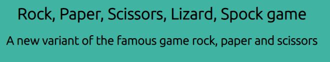

# Rock, Paper, Scissor, Lizard, Spock game
Rock Paper Scissors Lizard Spock is an extension of the classic game of chance, Rock Paper Scissors, created by Sam Kass and Karen Bryla. Sam Kass explains he created the expanded game because it seemed like most games of Rock Paper Scissors with people you know would end in a tie.

In this game, users will learn the rules of Rock, Paper, Scissors, Lizard, Spock game and play versus the computer. And the first to reach 5 wins, wins the game. 
The computer will choose randomly everytime. 

This game is targeted towards adults and children, you can learn the game from the page and apply it to in real life game aswell. Practicing this game on this page will give you an advantage when you will play versus your friends. 

## Features

* Header
- Featured at the top of the page, the name of the game: Rock, Paper, Scissor, Lizard, Spock game. The font fits the theme and the contrast of the background.
- The header clearly say what this page is about

